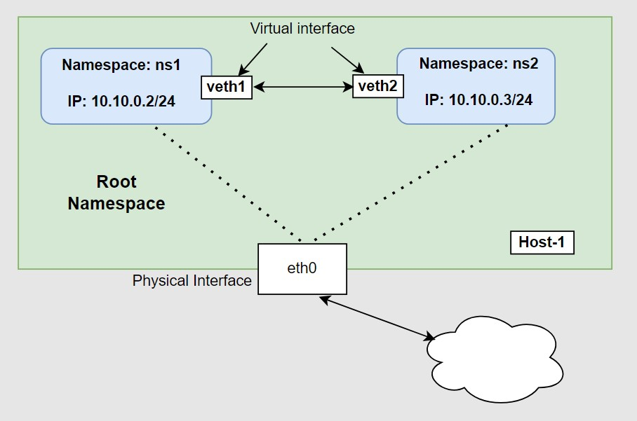

**Creating network namespaces in linux system and connecting two network namespaces using virtual cable:**
===

In Linux, the network namespace is a feature that allows you to create multiple isolated instances of the network stack. Each network namespace has its own network interfaces, routing tables, firewall rules, and network-related settings. This isolation enables you to run processes with their own networking environments, keeping them separate from each other and the host system.

Please note that manipulating network namespaces requires administrative privileges, so you might need to use 'sudo' to execute some of these commands.



Here's a step-by-step guide to creating virtual network namespaces:

**1. Check if your system supports network namespaces by running the following command:**
```
sudo ip netns
```
_If the command outputs a list of existing network namespaces, it means your system supports them. Otherwise, you may need to enable network namespace support in your kernel or use a different distribution that supports it._

**2. Create a new network namespace using the following command:**
```
sudo ip netns add <namespace_name>

sudo ip netns add ns1
sudo ip netns add ns2
```
_Replace <namespace_name> with a name of your choice for the new network namespace._

```
# After created namespace check the created namespace:

sudo ip netns
ns1
ns2
```
**3. Create the virtual network interfaces for the namespaces. You can create virtual Ethernet pairs to simulate network connections between namespaces or connect namespaces to virtual interfaces:**
```
# Creating a virtual Ethernet pair or virtual cable:

sudo ip link add veth1 type veth peer name veth2
```

```
# check the virtual network interfaces:

sudo ip add
```

_This command creates a pair of virtual Ethernet interfaces named veth1 and veth2. You can then assign each interface to a different network namespace._

**4. Assigning virtual interfaces to Network Namespaces:**
```
sudo ip link set <virtual_interface> netns <namespace_name>

sudo ip link set veth1 netns ns1
sudo ip link set veth2 netns ns2
```

**5. Assign IP addresses to the virtual interfaces within the network namespace. For example:**

```
sudo ip netns exec <namespace_name> ip addr add <ip_address>/<subnet_mask> dev <interface_name>

sudo ip netns exec ns1 ip addr add 10.10.0.2/24 dev veth1

sudo ip netns exec ns2 ip addr add 10.10.0.3/24 dev veth2
```

_Replace <namespace_name> with the name of the network namespace, <ip_address> with the desired IP address, <subnet_mask> with the subnet mask for the network, and <interface_name> with the name of the virtual interface._

**6. Enable the virtual interfaces within the network namespace:**
```
sudo ip netns exec <namespace_name> ip link set dev <interface_name> up

sudo ip netns exec ns1 ip link set dev veth1 up
sudo ip netns exec ns2 ip link set dev veth2 up
```

**7. Testing the Connectivity:**
```
# Enter the namespace ns1: 

sudo ip netns exec ns1 bash

sudo ping 10.10.0.3

PING 10.10.0.3 (10.10.0.3) 56(84) bytes of data.
64 bytes from 10.10.0.3: icmp_seq=1 ttl=64 time=0.047 ms
64 bytes from 10.10.0.3: icmp_seq=2 ttl=64 time=0.077 ms
64 bytes from 10.10.0.3: icmp_seq=3 ttl=64 time=0.073 ms

sudo exit
```
```
# Enter the namespace ns2: 

sudo ip netns exec ns2 bash

sudo ping 10.10.0.2     

PING 10.10.0.2 (10.10.0.2) 56(84) bytes of data.
64 bytes from 10.10.0.2: icmp_seq=1 ttl=64 time=0.045 ms
64 bytes from 10.10.0.2: icmp_seq=2 ttl=64 time=0.087 ms
64 bytes from 10.10.0.2: icmp_seq=3 ttl=64 time=0.106 ms

sudo exit
```

**8. Removing a Network Namespace:**
```
sudo ip netns del ns1
sudo ip netns del ns2
```


Now you have successfully created a virtual network namespace in Linux. You can repeat the above steps to create additional namespaces or configure the namespace further as needed. Remember that the configuration within each network namespace is isolated from the rest of the system, allowing you to have separate network environments for different applications or processes.

Network namespaces provide a powerful mechanism for network isolation and are an essential component in modern Linux systems, particularly in the context of containerization and virtualization.

`See More:`
--
[medium.com](https://medium.com/@technbd)
